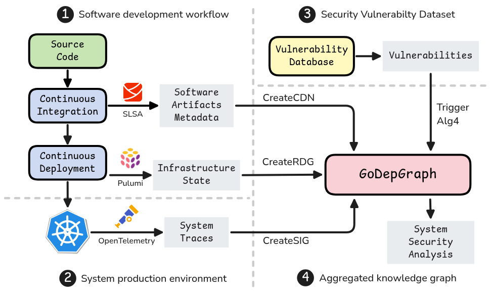

# GoDepGraph

GoDepGraph is a Proof-of-Concept implementation for the research paper "Reconstructing Systems-of-Systems architectures towards analyzing cascading attacks".

It can be integrated in workflows for Vulnerability Potential Impact and Propagation analysis, based upon source code and components interactions between Constituent Systems in the context of System of Systems.

<div align="center">
  
</div>

It has 4 main capabilities, mirrored in API services:
- `CDN` to construct the _Call-graph Dependency Network_ of a Go codebase ;
- `RDG` to produce a _Resource Deployment Graph_ by parsing Pulumi states ;
- `SIG` to build a _System Interaction Graph_ out of OpenTelemetry traces ;
- `Alg4` to bind resources from the 3 previous knowledge graphs and add vulnerabilities to analyze the potential propagation.

- [Deployment](#deployment)
  - [Kubernetes](#kubernetes)
  - [Local setup](#local-setup)
- [Examples](#examples)

## Deployment

### Kubernetes

You can deploy the Proof-of-Concept on a Kubernetes cluster.
It is going to deploy GoDepGraph and a Neo4J database, already configured to perform analyses.

> [!NOTE]
> GoDepGraph emit OpenTelemetry signals, especially traces and logs.
> If you would like to understand how it is set up, see [`global/otel.go`](/global/otel.go).

### Local setup

You can setup a Neo4J container using the following.

```bash
docker run -p 7474:7474 -p 7687:7687 -e NEO4J_AUTH=neo4j/password123 neo4j:5.22.0
```

You can setup a Jaeger (close to an OpenTelemetry-Collector, limited to traces) using the following.

```bash
docker run --rm --name jaeger \
  -p 16686:16686 \
  -p 4317:4317 \
  -p 4318:4318 \
  -p 5778:5778 \
  -p 9411:9411 \
  jaegertracing/jaeger:2.5.0
```

You can run GoDepGraph using the following.

```bash
go run cmd/godepgraph/main.go \
  --swagger \
  --neo4j.uri bolt://localhost:7687 \
  --neo4j.user neo4j \
  --neo4j.pass password123 \
  --neo4j.dbname neo4j
```
