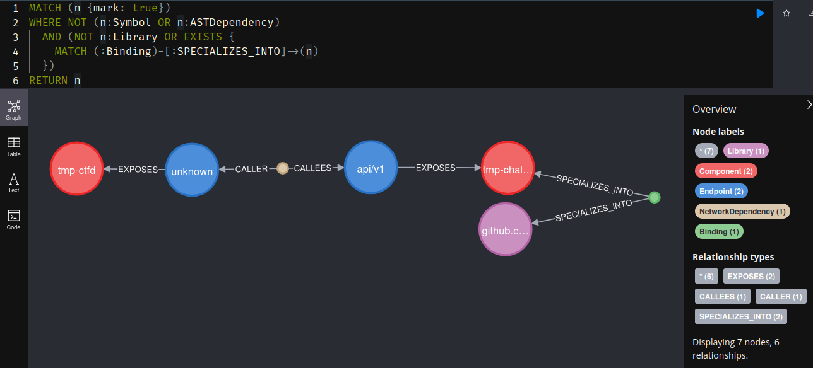

# Example

This example shows a step-by-step workflow to generate the sample data from a Capture The Flag cybersecurity event.
Challenges comes from [here](https://github.com/nobrackets-ctf/NoBrackets-2024/tree/main/finale).

Multiple components, their deployment and tools are shared by [CTFer.io](https://ctfer.io) who sponsored the [NoBrackets](https://www.linkedin.com/showcase/nobrackets-ctf/) 2024 CTF Final round (Nov. 20th). The deployment code was used to deploy the real infrastructure of the event, but evolved through time. We will be using a recent version.

## Preamble

Requirements:
- [`docker`](https://docs.docker.com/engine/install/) ;
- [`kind`](https://kind.sigs.k8s.io/docs/user/quick-start/#installation) ;
- [`helm`](https://helm.sh/docs/intro/install/) ;
- [`go`](https://go.dev/doc/install) ;
- [`pulumi`](https://www.pulumi.com/docs/iac/download-install/).

This experiment focuses on the potential impact of [CVE-2025-53632](https://nvd.nist.gov/vuln/detail/CVE-2025-53632), affecting the component [Chall-Manager](https://github.com/tfer-io/chall-manager).
The version we are using is patched to this vulnerability, but we will simulate it over the latest version to illustrate propagation, and on a similar symbol (same functionality, different name and prototype). Indeed, older versions had issues with OpenTelemetry support and trace propagation, so could not be used as part of this example.

To keep it short, the vulnerability is a zip-slip. Given the way Chall-Manager works internally, a tampered version of Pulumi or its providers could be overwritten in live, or a cached dependencies. This could lead to arbitrary code execution, which in turn could propagate to subsequent systems through tampered responses.

> [!WARNING]
> We won't provide an actual exploit of CVE-2025-53632, and will work on the hypothesis of one.

## Summary

This example's goal is to illustrate how a vulnerability laying in source code can propagate through Constituent Systems and affect the security posture of the overall System of Systems.

A complexity in this scenario is in the essence of the infrastructure: it is hosting a cybersecurity platform, so has been hardened to host vulnerable services adjacently to sensitive systems (e.g. the CTF platform). In this context, we also expect to evaluate the quality of the analysis through pivots by hosting components.

## Step-by-step

> [!NOTE]
> The steps required to generate the data are embedded into bash scripts.
> Documenting them more is not considered relevant, but we suggest curious readers to take a look so they deeply understand what we will be looking at.

All the following require your terminal to be in [example](/example/) context.

1.  First of all, we need to deploy the infrastructure the simulation is going to run on.
    To do so, open a terminal and run the following.
    ```bash
    ./kind.sh
    ```

    Please wait up to 5 minutes for Kind to be up & running. After this time, it should be fine passing to step 2.

2.  Then, deploy the CTF System of Systems.
    This step is optional if you already have extracted data.
    ```bash
    ./exp.sh
    ```

    At the end, it extracts all the input data for the next step into directory [`extract`](extract/).

3.  Analyze the results of step 2, i.e. creating the CDN, RDG and SIG of the simulated infrastructure.
    ```bash
    ./analysis.sh
    ```

4.  Bind Chall-Manager between the CDN, RDG and SIG infos.
    This step is required as we cannot guess what library correspond to which components, and which asset in the knowledge graphs.
    It could nonetheless leverage additional data in a CI/CD workflow to infer this binding.
    ```bash
    cd ..
    export PULUMI_CONFIG_PASSPHRASE=""
    export URL="localhost:$(cd deploy && pulumi stack output godepgraph-port)"
    ./bin/godepgraph-cli --url $URL \
        alg4 binding create \
        --library.name github.com/ctfer-io/chall-manager \
        --library.version v0.5.1 \
        --component.name tmp-chall-manager \
        --component.version dev
    ```

    The component under analysis does not host Components, so we don't bind an `Asset`.

    Due to a bug in Chall-Manager we have to bind the component to the version `dev` rather than `v0.5.1`.

5. We also bind the Endpoints to Symbols, which could also be leveraged by naming conventions in a controlled environment (e.g. a framework, conventions in a SoS). Here, we use `api/v1` as the endpoint, which shadows lower-level functions due to the use of the HTTP gateway, another server running in the same process that translates HTTP requests to gRPC ones for compatibility and adoption purposes.
    ```bash
    ./bin/godepgraph-cli --url $URL alg4 serves create \
        --symbol.identity "(*github.com/ctfer-io/chall-manager/api/v1/challenge.Store).CreateChallenge" \
        --endpoint.name "api/v1" \
        --component.name tmp-chall-manager \
        --component.version dev

    ./bin/godepgraph-cli --url $URL alg4 serves create \
        --symbol.identity "(*github.com/ctfer-io/chall-manager/api/v1/challenge.Store).UpdateChallenge" \
        --endpoint.name "api/v1" \
        --component.name tmp-chall-manager \
        --component.version dev
    ```
6.  Then add the vulnerability in the source code.
    ```bash
    ./bin/godepgraph-cli --url $URL \
        alg4 vulnerability create \
        --identity "CVE-2025-53632 altered" \
        --threatens "github.com/ctfer-io/chall-manager/pkg/scenario.DecodeOCI"
    ```

7.  You can now open Neo4J in your browser and travel through the processed data, using [example ciphers](#ciphers) or [create your own](https://neo4j.com/docs/getting-started/cypher/).
    ```bash
    open "http://localhost:$(cd deploy && pulumi stack output neo4j-ui-port)" &
    ```

    Don't forget the settings to connect:
    - Connect URL: `echo "neo4j://localhost:$(cd deploy && pulumi stack output neo4j-api-port)"`
    - Database: `(cd deploy && pulumi stack output neo4j-dbname)`
    - Authentication type: Username / Password
    - Username: `(cd deploy && pulumi stack output neo4j-user)`
    - Password: `(cd deploy && pulumi stack output neo4j-pass)`

## Ciphers

The following are example ciphers to use when analyzing the data.

### All symbols potentially vulnerable

> [!WARNING]
> This may result in **a lot** of nodes.
> It is one limitation of the current approach, which should be improved in future work with Data Flow Analysis (DFA) to narrow down the propagation.

```cypher
MATCH (v1 {mark: true})<-[:CALLER]-(a1:ASTDependency)-[:CALLEES]->(v2 {mark: true})
RETURN v1, v2, a1
```

### All vulnerable nodes, once propagated

```cypher
MATCH (v:Vulnerability)
MATCH (v)-[:THREATENS]->(s:Symbol)
OPTIONAL MATCH (s2:Symbol)<-[:CALLER]-(a:ASTDependency)-[:CALLEES]->(s)
MATCH (l:Library)
WHERE (l)-[:PROVIDES]->(s) OR (l)-[:PROVIDES]->(s2)
OPTIONAL MATCH (c:Component)<-[:SPECIALIZES_INTO]-(b:Binding)-[:SPECIALIZES_INTO]->(l)
OPTIONAL MATCH (e:Endpoint)-[:EXPOSES]->(s)
RETURN v, s, a, s2, l, b, c, e
```

### All Components that interact with a Component embedding a vulnerable symbol

> [!WARNING]
> The following cypher is not generic and works in the case of this example.
> Rationale is that API endpoints makes direct call to the vulnerable symbol, thus we don't need to look for all paths from an endpoint to a vulnerable symbol.

```cypher
// Get the vulnerability, and the symbol it threatens
MATCH (v:Vulnerability)
MATCH (v)-[:THREATENS]->(s:Symbol)

// Then the symbols that calls it (Chall-Manager has no wrapper around it,
// so 1 hop is enough -> it is not a generic query)
OPTIONAL MATCH (s2:Symbol)<-[:CALLER]-(a:ASTDependency)-[:CALLEES]->(s)

// Get the vulnerable library that provides the threatened symbols
MATCH (l:Library)
WHERE (l)-[:PROVIDES]->(s) OR (l)-[:PROVIDES]->(s2)

// Then look for the Component that represent the Library -> it is more than a
// simple library, it is a running app
OPTIONAL MATCH (c:Component)<-[:SPECIALIZES_INTO]-(b:Binding)-[:SPECIALIZES_INTO]->(l)

// Get the endpoints that serves symbols of the Library/Component
OPTIONAL MATCH (e:Endpoint)
WHERE (e)-[:SERVES]->(s) OR (e)-[:SERVES]->(s2)

// Then get the adjacent components that interacts with these endpoints
OPTIONAL MATCH (c2:Component)<-[:EXPOSES]-(e2:Endpoint)<-[:CALLER]-(n:NetworkDependency)-[:CALLEES]->(e)

// Return everything
RETURN v, s, a, s2, l, b, c, e, c2, n, e2
```

### All objects that are potentially vulnerable

We filter out `Library` objects that are not `Component` objects, and avoid `Symbol` and `ASTDependency` objects to simplify understanding of the potential blast radius of the vulnerability.

```cypher
MATCH (n {mark: true})
WHERE NOT (n:Symbol OR n:ASTDependency)
  AND (NOT n:Library OR EXISTS {
    MATCH (:Binding)-[:SPECIALIZES_INTO]->(n)
  })
RETURN n
```

Using the simulation, you should end up with something like the following image.

<div align="center">
    
</div>

## Troubleshoot

**Q**: The `kind.sh` script does not seem to work.

**A**: Make sure your port 5000 is available (`sudo ss -laptn | grep 5000`), and no other docker container is named `registry` (`docker ps | grep registry`) else it will be erased (the same holds for kind). Also, make sure you have a stable and good internet connection to download all required Docker images. Most images are copied locally to limit bandwidth impact, but not all.

---

**Q**: I see error message on challenges failing to get created, by the end of `exp.sh`. Does it impact the results ?

**A**: Yes it has impact, but we are not focusing on the result but more on the interactions between components. Seeing errors is a sign of interactions between the components (and a bug in timeout handling in Chall-Manager), so is completly fine. Through the analysis step, we won't see much difference if there are errors or not.

---

**Q**: The `exp.sh` seems to end with a failure, after a long wait. What happens ?

**A**: It might be because your machine has trouble running everything, and in this case, running the Pod used to extract the OpenTelemetry data. This would be a problem for the next steps. You can run the following to run just this step, from the root directory of the project in your terminal.

```bash
export PULUMI_CONFIG_PASSPHRASE=""
export URL="localhost:$(cd deploy && pulumi stack output godepgraph-port)"
./bin/godepgraph-cli --url $URL sig create --file example/extract/otel_traces
```
